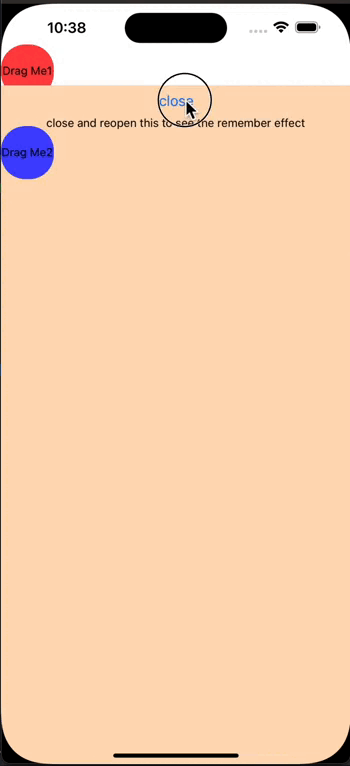

# react-native-draggable-floating

A simple draggable widget sticky to left or right side of its parent. Using the `react-native-reanimated` and `react-native-gesture-handler`.  


## Installation

```sh
npm install react-native-draggable-floating
```

## Usage

```js
import DraggableView from 'react-native-draggable-floating';

<DraggableView>
  <View />
</DraggableView>
```

## Props


 Prop | Type | Default | Description 
 --- | --- | --- | ---
 `stickyLeft` | `boolean` | `false` | Whether to stick to the left side of its parent. 
`initialOffsetY` | `number` | 0 | The initial offset of the widget from the top of its parent. If negative, the offset will be the bottom. 
`onPositionChange` | `(x: number; y: number) => void` | undefined | call back when you release the widget and after the sticky animation, it's useful when you want to save the position when recreating the container view

## License

MIT

---

Made with [create-react-native-library](https://github.com/callstack/react-native-builder-bob)
